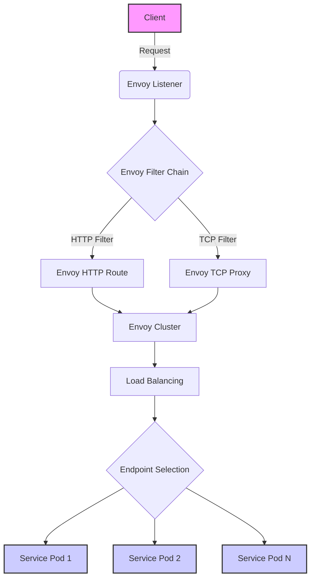

## 简介

`lstio` 应该是现在的服务网格事实标准.

## 概念速览

### 功能介绍

[Istio / 概念](https://istio.io/latest/zh/docs/concepts/)

- 流量管理：负载均衡，动态旅游，灰度发布
- 可观察性：调用链，访问日志，监控
- 策略执行：限流，ACL
- 安全：认证和鉴权

### 基础架构

随着版本变化，组件能力的加强，降低复杂性，基础架构慢慢简化。

- 数据层面：envoy
- 控制层面：Istiod
    - Pilot：转换规则，下发规则到 proxy。主要是服务发现的规则，以及流量的管理。提供了 a/b 测试，金丝雀发布。弹性（超时，重试，熔断）
    - Mixer：接管流量。每次 proxy 之间的请求，都会上传和报告。所以可以控制访问，以及收集遥测数据。主要是因为 envoy 功能的增强，很多功能整合到了 envoy，所以 mixer 功能变少。
    - Citadel：服务间的安全认证。例如双向 tls 的安全
    - Galley：Istio 配置的管理组件，解耦 istio 与 [[笔记/point/k8s|k8s]] ，避免强绑定。验证、处理和分发配置信息到各个 Istio 组件。

### istio 资源对象/图

相关资源对象：

- Gateway 接受外部流量，相当于 ingress-svc
- VitualService 后端应用的集合，相当于 service
- DestinationRule: 一些规则，让 VitualService 更加细化得转发到特定的 pod
- cluster, endpoint, filter 等内容属于 [[笔记/lstio#envoy|envoy]] 内部

其他资源：

- ServiceEntry：应用依赖集群外部服务
- Engress： 正常返回之类的流量
- EnvoyFilter：控制 envoy 中的 filter 规则

![[附件/istio流量图.excalidraw.svg]]

## istioctl

### 安装

1. 下载 [Releases · istio/istio](https://github.com/istio/istio/releases)
2. `tar xf istio-1.20.0-linux-amd64.tar.gz`
3. `vim ~/.bashrc` 添加 bin 目录到 PATH 变量 `export PATH=/root/istio-1.20.0/bin:$PATH`

### istioctl 概念和命令

`istioctl` 由核心 `core` 与插件 `addons` 组成。不同的应用场景，就是不同插件的组合。

常见组件：

- `istio core` CRD 之类的
- `istiod` 控制平面
- `ingress/egress gateway` 出入网关

初始命令：

- `istioctl profile list` 查看所有组合。每个组合对应 `manifests/profiles` 下面的一个 yml 文件。
    - `demo` 比较完整。有采集指标，适合**演示**
    - `default` 默认适合**生产环境**
    - `minimal` 仅部署控制平面
    - `preview` 更高级别 demo，**新功能尝鲜**
    - `istioctl profile diff demo empty` 查看 2 个配置的区别
- `istioctl manifest generate --set profile=demo` 生成 yml 文件
- `istioctl install`
    - `--set profile=demo` 选择配置
    - `--set xxx.xxx.xxx=true` 修改某个 profile 的值
    - `-f xxx.yml` 自定义指定 yml

常用操作命令：

- 检测是否正常
    - `istioctl analyze -n default` 检测 xxx 空间是否正常注入
    - `istioctl experimental precheck` 检测更新，部署，调整后控制平面是否正常
- 卸载 `istioctl uninstall -f demo.yml` 或 `istioctl uninstall --purge`
- 端口代理 `istioctl dashboard --address 0.0.0.0 kiali`
- 代理查询 `istioctl proxy-status`

## envoy

### 关键组件

- listener：做为流量入口，监听一个 `ip:port`，可以代理 tcp，http，gRPC 之类的流量
- filter：处理进出 envoy 的流量。修改，转换，拦截，响应。还可以路由，权限检查。
- route：根据请求信息，指定使用哪一个 cluster
- cluster: 是 envoy 用来描述后端的一个逻辑集合。envoy 通过 cluster 得知如何连接到特定服务
- endpoint：cluster 中的一个实例。通常是一个服务实例的 `ip:port`. envoy 通过服务发现来动态了解 endpoint

### envoy 流量图

- xDS 的 x 指某个资源，DS 是服务发现的意思
    - 监听器 LDS
    - 集群 CDS
    - 端点 EDS
    - 路由 RDS
    - 图中 filter 是由 EnvoyFilter 创建。其他资源信息都来自于 xDS。例如 filter 后的 Route 和 Proxy 就是来自于 RDS



## 相关操作

### 初始验证

```shell
# 安装istio的demo方案
istioctl install --set profile=demo

# 加上标签，开始自动注入
# 删除 istio-injection-
# 覆盖 --overwrite
kubectl label namespace default istio-injection=enabled --overwrite
# 确认打上了标签
kubectl get namespaces default --show-labels
# 创建容器
kubectl create deployment my-nginx --image=nginx:latest

# 验证
# 发现多个pod和很多内容
kubectl get po
kubectl describe pod my-nginx-86d74cfc8f-5wvjn
```

### 容器解读

常见问题

- sidecar 如何接入流量？初始化动作，实现容器网络和 sidecar 网络一致
- 访问 pod 的流量，怎么给 proxy？定制大量防火墙规则
- 流量接管的规则从哪来？istiod 的 polot 分发

对应内容

- istio-init：完成初始化动作，配置防火墙
- intio-proxy：拉取配置，处理流量

### 手动注入 envoy

- 创建命名空间
- 创建 envoy 配置文件
    - `admin.address` 是管理面板地址，html 页面观测
    - `static_resources.listeners.address` 是 pod 中 envoy 监听的端口，请求这个地址都会被 envoy 接管
    - `filter_chains` 中配置了 http 代理功能，同时指定接管的流量指向 local_cluster
    - `local_cluster` 的端口是 80，也就是我们 nginx 容器的默认端口
- 创建 pod 并挂载 envoy 配置文件。必须指定 2 个变量环境，envoy 才能正常监听 80 端口。

```yaml
apiVersion: v1
kind: Namespace
metadata:
  name: kentxxq
---
apiVersion: v1
kind: ConfigMap
metadata:
  name: envoy-sidecar-configmap
  namespace: kentxxq
data:
  envoy.yaml: |
    admin:
      address:
        socket_address: { address: 0.0.0.0, port_value: 8001 }
    static_resources:
      listeners:
        name: listener
        address:
          socket_address: { address: 0.0.0.0, port_value: 8002 }
        filter_chains:
        - filters:
          - name: envoy.filters.network.http_connection_manager
            typed_config:
              "@type": type.googleapis.com/envoy.extensions.filters.network.http_connection_manager.v3.HttpConnectionManager
              stat_prefix: ingress_http
              codec_type: AUTO
              # 启用http代理的路由功能
              http_filters:
              - name: envoy.filters.http.router
                # 一定要设定该typed_config属性，否则提示无法找到router
                typed_config:
                  "@type": type.googleapis.com/envoy.extensions.filters.http.router.v3.Router
              # 定制router配置
              route_config:
                name: tomcat_route
                virtual_hosts:
                - name: tomcat_web
                  domains: ["*"]
                  routes:
                  - match: { prefix: "/" }
                    route: { cluster: local_cluster }

      clusters:
      - name: local_cluster
        type: STATIC
        lb_policy: ROUND_ROBIN
        load_assignment:
          cluster_name: local_cluster
          endpoints:
          - lb_endpoints:
            - endpoint:
                address:
                  socket_address: { address: 127.0.0.1, port_value: 80 }
---
apiVersion: v1
kind: Pod
metadata:
  name: tt-sidecar
  namespace: kentxxq
spec:
  containers:
  - image: kubernetes-register.sswang.com/mypro/envoy:v1.25.3
    name: envoysidecar
    env:
    - name: "ENVOY_UID"
      value: "0"
    - name: "ENVOY_GID"
      value: "0"
    volumeMounts:
    - name: envoyconf
      mountPath: /etc/envoy/
      readOnly: true
  - name: nginx-demo
    image: nginx:latest
  volumes:
  - name: envoyconf
    configMap:
      name: envoy-sidecar-configmap
      optional: false
```

验证：

```shell
# 可以正常请求到nginx容器的80端口
curl cluster-ip:8002
```


注入流程：
- [Istio / Installing the Sidecar](https://istio.io/latest/docs/setup/additional-setup/sidecar-injection/#manual-sidecar-injection)