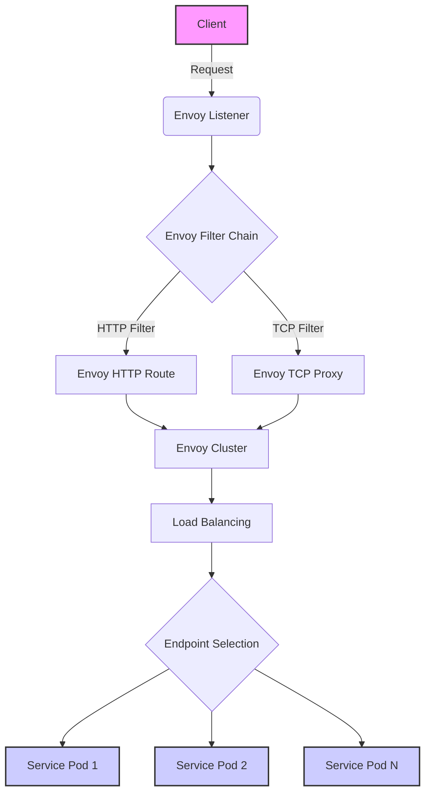

## 简介

`lstio` 应该是现在的服务网格事实标准.

## 概念速览

### 功能介绍

[Istio / 概念](https://istio.io/latest/zh/docs/concepts/)

- 流量管理：负载均衡，动态旅游，灰度发布
- 可观察性：调用链，访问日志，监控
- 策略执行：限流，ACL
- 安全：认证和鉴权

### 基础架构

随着版本变化，组件能力的加强，降低复杂性，基础架构慢慢简化。

- 数据层面：envoy
- 控制层面：Istiod
    - Pilot：转换规则，下发规则到 proxy。主要是服务发现的规则，以及流量的管理。提供了 a/b 测试，金丝雀发布。弹性（超时，重试，熔断）
    - Mixer：接管流量。每次 proxy 之间的请求，都会上传和报告。所以可以控制访问，以及收集遥测数据。主要是因为 envoy 功能的增强，很多功能整合到了 envoy，所以 mixer 功能变少。
    - Citadel：服务间的安全认证。例如双向 tls 的安全
    - Galley：Istio 配置的管理组件，解耦 istio 与 [[笔记/point/k8s|k8s]] ，避免强绑定。验证、处理和分发配置信息到各个 Istio 组件。

### istio 资源对象/图

相关资源对象：

- Gateway 接受外部流量，相当于 ingress-svc
- VirtualService 定义了流量的路由规则和目标服务。是后端应用的集合，相当于 service。但是这个 service 对接的是每个 pod 里的 sidecar，而不是容器
- cluster, endpoint, filter 等内容属于 [[笔记/lstio#envoy|envoy]] 内部

其他资源：

- ServiceEntry：应用依赖集群外部服务
- Engress： 正常返回之类的流量
- EnvoyFilter：控制 envoy 中的 filter 规则
- DestinationRule: 一些规则，流量经过了 filter 后如何到达容器（负载均衡，连接池的大小，请求失败或者错误以后的重试和故障转移，tls 设置等）

![[附件/istio流量图.excalidraw.svg]]

## istioctl

### 安装

1. 下载 [Releases · istio/istio](https://github.com/istio/istio/releases)
2. `tar xf istio-1.20.0-linux-amd64.tar.gz`
3. `vim ~/.bashrc` 添加 bin 目录到 PATH 变量 `export PATH=/root/istio-1.20.0/bin:$PATH`

### istioctl 概念和命令

`istioctl` 由核心 `core` 与插件 `addons` 组成。不同的应用场景，就是不同插件的组合。

常见组件：

- `istio core` CRD 之类的
- `istiod` 控制平面
- `ingress/egress gateway` 出入网关

初始命令：

- `istioctl profile list` 查看所有组合。每个组合对应 `manifests/profiles` 下面的一个 yml 文件。
    - `demo` 比较完整。有采集指标，适合**演示**
    - `default` 默认适合**生产环境**
    - `minimal` 仅部署控制平面
    - `preview` 更高级别 demo，**新功能尝鲜**
    - `istioctl profile diff demo empty` 查看 2 个配置的区别
- `istioctl manifest generate --set profile=demo` 生成 yml 文件
- `istioctl install`
    - `--set profile=demo` 选择配置
    - `--set xxx.xxx.xxx=true` 修改某个 profile 的值
    - `-f xxx.yml` 自定义指定 yml

常用操作命令：

- 检测是否正常
    - `istioctl analyze -n default` 检测 xxx 空间是否正常注入
    - `istioctl experimental precheck` 检测更新，部署，调整后控制平面是否正常
- 卸载 `istioctl uninstall -f demo.yml` 或 `istioctl uninstall --purge`
- 端口代理 `istioctl dashboard --address 0.0.0.0 kiali`
- 代理查询 `istioctl proxy-status`

一些可能用上的 yaml，可以用来展示流量用:

```shell
kubectl apply -f samples/addons/grafana.yaml 
kubectl apply -f samples/addons/prometheus.yaml 
kubectl apply -f samples/addons/kiali.yaml
kubectl apply -f samples/addons/extras/zipkin.yaml
```

## envoy

### 关键组件

- listener：做为流量入口，监听一个 `ip:port`，可以代理 tcp，http，gRPC 之类的流量
- filter：处理进出 envoy 的流量。修改，转换，拦截，响应。还可以路由，权限检查。
- route：根据请求信息，指定使用哪一个 cluster
- cluster: 是 envoy 用来描述后端的一个逻辑集合。cluster 是通过 `k8s-service` 创建出来的一个对象。 envoy 通过 cluster 得知如何连接到特定服务
- endpoint：cluster 中的一个实例。通常是一个服务实例的 `ip:port`. envoy 通过服务发现来动态了解 endpoint

### envoy 流量图

- xDS 的 x 指某个资源，DS 是服务发现的意思
    - 监听器 LDS
    - 集群 CDS
    - 端点 EDS
    - 路由 RDS
    - 图中 filter 是由 EnvoyFilter 创建。其他资源信息都来自于 xDS。例如 filter 后的 Route 和 Proxy 就是来自于 RDS



单个 pod 内的流入流出：

- 上面流入的流程没有变化
- 但是流出的流量，可能是其他 service。所以**流出的 cluster 不一定是同样的 `ip:port`**

![[附件/envoy流入流出简化图.png]]

同服务/跨服务流量图：

![[附件/envoy服务间流量图.png]]

## sidecar 注入实践

### 初始验证

```shell
# 安装istio的demo方案
istioctl install --set profile=demo

# 加上标签，开始自动注入
# 删除 istio-injection-
# 覆盖 --overwrite
kubectl label namespace default istio-injection=enabled --overwrite
# 确认打上了标签
kubectl get namespaces default --show-labels
# 创建容器
kubectl create deployment my-nginx --image=nginx:latest

# 验证
# 发现多个pod和很多内容
kubectl get po
kubectl describe pod my-nginx-86d74cfc8f-5wvjn
```

### 手动注入 envoy

yaml 解读：

- 创建命名空间
- 创建 envoy 配置文件
    - `admin.address` 是管理面板地址，html 页面观测
    - `static_resources.listeners.address` 是 pod 中 envoy 监听的端口，请求这个地址都会被 envoy 接管
    - `filter_chains` 中配置了 http 代理功能，同时指定接管的流量指向 local_cluster
    - `local_cluster` 的端口是 80，也就是我们 nginx 容器的默认端口
- 创建 pod 并挂载 envoy 配置文件。必须指定 2 个变量环境，envoy 才能正常监听 80 端口。

```yaml
apiVersion: v1
kind: Namespace
metadata:
  name: kentxxq
---
apiVersion: v1
kind: ConfigMap
metadata:
  name: envoy-sidecar-configmap
  namespace: kentxxq
data:
  envoy.yaml: |
    admin:
      address:
        socket_address: { address: 0.0.0.0, port_value: 8001 }
    static_resources:
      listeners:
        name: listener
        address:
          socket_address: { address: 0.0.0.0, port_value: 8002 }
        filter_chains:
        - filters:
          - name: envoy.filters.network.http_connection_manager
            typed_config:
              "@type": type.googleapis.com/envoy.extensions.filters.network.http_connection_manager.v3.HttpConnectionManager
              stat_prefix: ingress_http
              codec_type: AUTO
              # 启用http代理的路由功能
              http_filters:
              - name: envoy.filters.http.router
                # 一定要设定该typed_config属性，否则提示无法找到router
                typed_config:
                  "@type": type.googleapis.com/envoy.extensions.filters.http.router.v3.Router
              # 定制router配置
              route_config:
                name: tomcat_route
                virtual_hosts:
                - name: tomcat_web
                  domains: ["*"]
                  routes:
                  - match: { prefix: "/" }
                    route: { cluster: local_cluster }

      clusters:
      - name: local_cluster
        type: STATIC
        lb_policy: ROUND_ROBIN
        load_assignment:
          cluster_name: local_cluster
          endpoints:
          - lb_endpoints:
            - endpoint:
                address:
                  socket_address: { address: 127.0.0.1, port_value: 80 }
---
apiVersion: v1
kind: Pod
metadata:
  name: tt-sidecar
  namespace: kentxxq
spec:
  containers:
  - image: kubernetes-register.sswang.com/mypro/envoy:v1.25.3
    name: envoysidecar
    env:
    - name: "ENVOY_UID"
      value: "0"
    - name: "ENVOY_GID"
      value: "0"
    volumeMounts:
    - name: envoyconf
      mountPath: /etc/envoy/
      readOnly: true
  - name: nginx-demo
    image: nginx:latest
  volumes:
  - name: envoyconf
    configMap:
      name: envoy-sidecar-configmap
      optional: false
```

验证：

```shell
# 可以正常请求到nginx容器的80端口
curl cluster-ip:8002
```

> 官方注入流程文档 [Istio / Installing the Sidecar](https://istio.io/latest/docs/setup/additional-setup/sidecar-injection/#manual-sidecar-injection)

### 容器解读

#### 容器注入和启动

常见问题：

- sidecar 如何接入流量？初始化动作，实现容器网络和 sidecar 网络一致
- 访问 pod 的流量，怎么给 proxy？定制大量防火墙规则
- 流量接管的规则从哪来？istiod 的 pilot 分发

流程：

1. 先部署 istiod（galley，pilot）
2. 用户提交 yaml，被 pilot 监听到
    1. 使用 istio-init 初始化动作，配置防火墙
    2. intio-proxy（sidecar）：拉取配置，处理流量。内部有 pilot-agent 和 envoy
        1. pilot-agent 和 istiod/polit 建立连接，拿到配置后转换成 envoy 配置。同时这个连接不会关闭，一旦出现变更 istiod/polit 可以主动推送变化
        2. 启动 envoy

课件版：

```
1 基本环境状况
	istio构建于k8s集群之上，所有的请求都是基于k8s的apiserver组件来接收
2 接收请求
	当用户发起一个请求(通过namespace自动注入sidecar或者手工kube-inject注入sidecar)
3 流程执行
	Pilot 监听 kube-apiserver 的请求变化。
	发现k8s创建请求，并且发现namespace包含注入标签或者手工kube-inject注入sidecar
	istio通过CRD对象，经由kube-apiserver对pod进行属性修改，添加大量sidecar相关的属性信息
		- 扩充istio-init、istio-proxy等容器属性
	pod启动时候，kubelet 调用cri-服务创建容器服务
		- 首先启动istio-init初始化应用容器，设定大量的proxy代理需要的防火墙规则
		- 初始化容器使命结束后，结合大量启动参数，拉起istio-proxy容器(因为他们是同一个镜像)
		- istio-proxy容器内部的pilot-agent 进程从 Pilot中获取流量策略配置
		- pilot-agent 把获取的配置转换成Envoy识别的规则，然后通过启动参数，拉起Envoy服务
		- Envoy 作为sidecar，根据转换后的规则对pod内部的所有流量进行管控
		- 启动应用服务容器，受sidecar的流量策略监管。
4 数据聚合
	istio-proxy对多有的流量数据、日志数据、检测数据、遥测数据进行聚合
	所有的内部应用容器的检测通过istio-proxy上的15020进行检测
	pilot-agent与istio的pilot等组件实时同步相关信息

注意：
	关于istio-proxy和应用容器的启动顺序由配置文件内部的顺序决定
	但是应用容器的服务检测，必须通过istio-proxy检测后，才会向外表示正常
```

#### 容器内部信息

pod 内部存在 app 和 sidecar

- 两个容器 ifconfig 的 ip ，网卡完全一致。（初始化容器干的）
- 会出现很多监听的端口：
    - 15000，15001，15006，15021，15090 都是被 envoy 进程所管理的
    - 15004，15020 是被 pilot-agent 进程管理的
- `kubectl logs -f -n istio-test pod名称 -c istio-init`
    - PROXY_UID=1337, PROXY_GID=1337,
        - 容器内输入 `id 1337` ，可以看到所有流量被 istio-proxy 用户接管
        - `uid=1337(istio-proxy) gid=1337(istio-proxy) groups=1337(istio-proxy)`
    - ISTIO_IN_REDIRECT 15006 **监听所有流量进入**
    - ISTIO_REDIRECT 15001 **监听流出地址**


> istio 的端口，作用说明 [Istio / Application Requirements](https://istio.io/latest/docs/ops/deployment/requirements/)

## istio 资源使用实践

### 基础使用

创建

- 新的命名空间 `istio-traffic-test`
- http 运行容器 `httpd1` 和 `httpd2`
- `web-svc`，`httpd-1-svc` 和 `httpd-2-svc`

```yaml
apiVersion: v1
kind: Namespace
metadata:
  name: istio-traffic-test
---
apiVersion: apps/v1
kind: Deployment
metadata:
  labels:
    server: httpd1
    app: web
  name: httpd1
  namespace: istio-traffic-test
spec:
  replicas: 1
  selector:
    matchLabels:
      server: httpd1
      app: web
  template:
    metadata:
      labels:
        server: httpd1
        app: web
    spec:
      containers:
      - image: busybox:v0.1
        name: httpd
        command: ["/bin/sh","-c","echo 'HTTP Web Page-1' > /var/www/index.html; httpd -f -p 8080 -h /var/www"]
---
apiVersion: apps/v1
kind: Deployment
metadata:
  labels:
    server: httpd2
    app: web
  name: httpd2
  namespace: istio-traffic-test
spec:
  replicas: 1
  selector:
    matchLabels:
      server: httpd2
      app: web
  template:
    metadata:
      labels:
        server: httpd2
        app: web
    spec:
      containers:
      - image: busybox:v0.1
        name: httpd
        command: ["/bin/sh","-c","echo 'HTTP Web Page-2' > /var/www/index.html; httpd -f -p 8080 -h /var/www"]
---
apiVersion: v1
kind: Service
metadata:
  name: httpd-1-svc
  namespace: istio-traffic-test
spec:
  selector:
    server: httpd1
  ports:
  - name: http
    port: 8080
---
apiVersion: v1
kind: Service
metadata:
  name: httpd-2-svc
  namespace: istio-traffic-test
spec:
  selector:
    server: httpd2
  ports:
  - name: http
    port: 8080
---
apiVersion: v1
kind: Service
metadata:
  name: web-svc
  namespace: istio-traffic-test
spec:
  selector:
    app: web
  ports:
  - name: http
    port: 8080
```

使用 `VirtualService` 真正转发流量，按照权重分配

```yaml
apiVersion: networking.istio.io/v1alpha3
kind: VirtualService
metadata:
  name: web-svc-vs
  namespace: istio-traffic-test
spec:
  hosts:
  - web-svc
  http:
  - route:
    - destination:
        host: httpd-1-svc
        port:
          number: 8080
      weight: 20
    - destination:
        host: httpd-2-svc
        port:
          number: 8080
      weight: 80
```

### 资源对象之间的关系

![[附件/istio资源对象之间的关系.png]]

### VirtualService 详解

#### VirtualService.spec

```yaml
apiVersion: networking.istio.io/v1beta1
kind: VirtualService
metadata:								# 元数据部分，包括VirtualServer的名称
  name: my-virtualserver
  namespace: default
spec:									# 定义VirtualServer的规则和配置
  hosts:								# 指定VirtualServer应用的主机名，可以是一个或多个
  - example.com							# 改地址必须能够被正常访问
  gateways:								# 指定VirtualServer关联的网关，可以是一个或多个
  - my-gateway
  http:									# 定义HTTP流量的路由规则
  - match:								# 指定匹配条件，
    - uri:								# 支持使用URI前缀匹配
        prefix: /path/to/url
    rewrite:							# 定义HTTP流量的路由重写规则
      uri: /
    route:								# 定义匹配条件满足时的路由目标
    - destination:						# 指定路由的目标服务
        host: api-service				# 指定目标服务的主机名，可以是k8s的service对象
        port:							# 指定目标服务的端口号
          number: 8080
```

#### 基于 url

- **改写了 url**
- 如果都不匹配，有一个默认路由 `xxx-svc`

```yaml
apiVersion: networking.istio.io/v1beta1
kind: VirtualService
metadata:
  name: traffic-route-rul
  namespace: istio-traffic-test
spec:
  hosts:
  - web-svc
  http:
  - match:
    - uri:
        prefix: /app1
    rewrite:
      uri: /
    route:
    - destination:
        host: httpd-1-svc
  - match:
    - uri:
        prefix: /app2
    rewrite:
      uri: /
    route:
    - destination:
        host: httpd-2-svc
  - route:
    - destination:
        host: xxx-svc
```

#### 基于权重

```yaml
apiVersion: networking.istio.io/v1beta1
kind: VirtualService
metadata:
  name: traffic-route-weight
  namespace: istio-traffic-test
spec:
  hosts:
  - web-svc
  http:
  - match:
    - port: 8080
    route:
    - destination:
        host: httpd-1-svc
      weight: 10
    - destination:
        host: httpd-2-svc
      weight: 90
```

### DestinationRule

#### DestinationRule.spec

- 必须配合 VirtualService 发挥作用
- subsets 有点像 service，通过标签拿到变成一个个 pod 集合。
- **一旦使用 subset 的时候，就相当于使用 subset 的角色来替换，VS 里面默认的 destination.host 属性，所以必须使用 subset 里的名称**

```yaml
apiVersion: networking.istio.io/v1beta1
kind: DestinationRule
metadata:									# 元数据部分，包括 DestinationRule 的名称
  name: <destinationrule-name>
spec:										# 规范部分，定义 DestinationRule 的规则和配置
  host: <service-host>						# 指定目标服务的主机名
  trafficPolicy:							# 流量策略配置部分
    loadBalancer:							# 负载均衡器配置
      simple: <load-balancer-configuration>	# 指定负载均衡策略，ROUND_ROBIN（轮询）策略。
      										# 主要是本地级别、轮询级别、http级别
    connectionPool:							# 连接池配置
      http:									# 指定 HTTP 连接池配置。
        http1MaxPendingRequests: 100		# 每个连接允许的最大挂起请求数
        maxRequestsPerConnection: 5			# 指定每个连接的最大请求数。
    outlierDetection:						# 异常检测配置
      consecutiveErrors: 5					# 指定连续错误的阈值。
      interval: 5s							# 指定检测间隔时间。
      baseEjectionTime: 30s					# 指定从负载均衡中排除主机的基本时间。
      maxEjectionPercent: 50				# 指定最大排除比例。
  subsets:									# 服务端点集合,用于路由规则中的流量拆分
  - name: xxxx
    labels:									# 使用标签对服务注册表中的服务端点进行筛选
      version: v3
    trafficPolicy:
      loadBalancer:
        simple: ROUND_ROBIN					# 支持默认的轮询调度
        consistentHash:						# 支持基于http的相关属性调度。比如httpHeaderName等
          httpCookie:
            name: user
```

#### 简单示例

```yaml
apiVersion: networking.istio.io/v1beta1
kind: DestinationRule
metadata:
  name: traffic-rule-subset
  namespace: istio-traffic-test
spec:
  host: web-svc
  subsets:
  - name: httpd1
    labels:
      server: httpd1
  - name: httpd2
    labels:
      server: httpd2 
---
apiVersion: networking.istio.io/v1beta1
kind: VirtualService
metadata:
  name: traffic-route-subset
  namespace: istio-traffic-test
spec:
  hosts:
  - web-svc
  http:
  - route:
    - destination:
        host: web-svc
        subset: httpd1
      weight: 70
    - destination:
        host: web-svc
        subset: httpd2
      weight: 30
```

#### 基于 ip 的会话保持

```yaml
apiVersion: networking.istio.io/v1beta1
kind: DestinationRule
metadata:
  name: traffic-rule-subset
  namespace: istio-traffic-test
spec:
  host: web-svc
  subsets:
  - name: http-web
    labels:
      app: web
    trafficPolicy:
      loadBalancer:
        consistentHash:
          useSourceIp: true
```

### Gateway

#### Gateway.spec

```yaml
apiVersion: networking.istio.io/v1beta1
kind: Gateway
metadata:							# 元数据部分，包括 Gateway 的名称
  name: my-gateway
spec:								# 规范部分，定义 Gateway 的规则和配置。
  selector:							# 选择器用于选择要将流量路由到的 Istio Ingress Gateway
    istio: ingressgateway			# 选择器标签用于匹配 Istio Ingress Gateway
  servers:							# 定义 Gateway 监听的服务器配置
  - port:							# 指定服务器的端口配置
      number: 80					# 指定服务器的端口号，这个是istioingressgateway暴露端口
      name: http					# 指定服务器的名称。
      protocol: HTTP				# 指定服务器的协议。
    hosts:							# 指定 Gateway 监听的主机名列表，
    - "*"							# 这里使用通配符 "*" 匹配所有主机。
```

#### 搭配使用

```yaml
apiVersion: networking.istio.io/v1beta1
kind: Gateway
metadata:
  name: traffic-route-gw
  namespace: istio-traffic-test
spec:
  selector:
    istio: ingressgateway
  servers:
  - port:
      number: 80
      name: http
      protocol: HTTP
    hosts:
    - "*"
---
apiVersion: networking.istio.io/v1beta1
kind: DestinationRule
metadata:
  name: traffic-route-subset
  namespace: istio-traffic-test
spec:
  host: "*"
  subsets:
  - name: httpd-1-svc
    labels:
      server: httpd1
---
apiVersion: networking.istio.io/v1beta1
kind: VirtualService
metadata:
  name: traffic-route-vs
  namespace: istio-traffic-test
spec:
  hosts:
  - "*"
  gateways:
  - traffic-route-gw
  http:
  - route:
    - destination:
        host: web-svc
        subset: httpd-1-svc
```

验证：

```shell
# 可以看到vs引用的gateway和配置的hosts
kubectl get vs
# 访问测试
curl ingressgateway-clusterIP或者loadbalanceIP
```


### Sidecar

#### Sidecar.spec

```yaml
apiVersion: networking.istio.io/v1beta1
kind: Sidecar
metadata:							# 包含了 Sidecar 对象的名称和命名空间
  name: my-sidecar
  namespace: my-namespace
spec:								# 定义了 Sidecar 对象的规范
  workloadSelector:					# 指定了与 Sidecar 关联的工作负载的标签选择器
    labels:
      app: my-app
  outboundTrafficPolicy:			# 定义了 Sidecar 的出站流量策略
    mode: REGISTRY_ONLY				# REGISTRY_ONLY，表示只允许与服务注册表中的服务进行通信
  egress:							# 定义了 Sidecar 的出口规则，即允许的外部主机和端口
    - hosts:
        - example.com				# 当前命名空间的 example.com的 service
        - "./*"						# 当前命名空间下是所有Service
    	- "istio-system/*"			# 匹配istio-system命名空间下的所有Service
      ports:
        - port: 80
          protocol: HTTP
        - port: 443
          protocol: HTTPS
    - hosts:						# 其他的访问交给istio-haha命名空间的服务
      - "istio-haha/*"
  ingress:							# 定义了 Sidecar 的入口规则，即允许的入站流量来源和目标
    - from:
        - namespaceSelector:        # 允许来自启用 Istio 注入的命名空间的流量
            matchLabels:
              istio-injection: enabled
      port:							# 将其转发到端口号为 8080 的 HTTP 目标
        number: 8080
        protocol: HTTP
      defaultEndpoint: my-service.default.svc.cluster.local    # 默认端点
```

## 参考案例

- [istio 在知乎大规模集群的落地实践 - 知乎](https://zhuanlan.zhihu.com/p/436796453)
